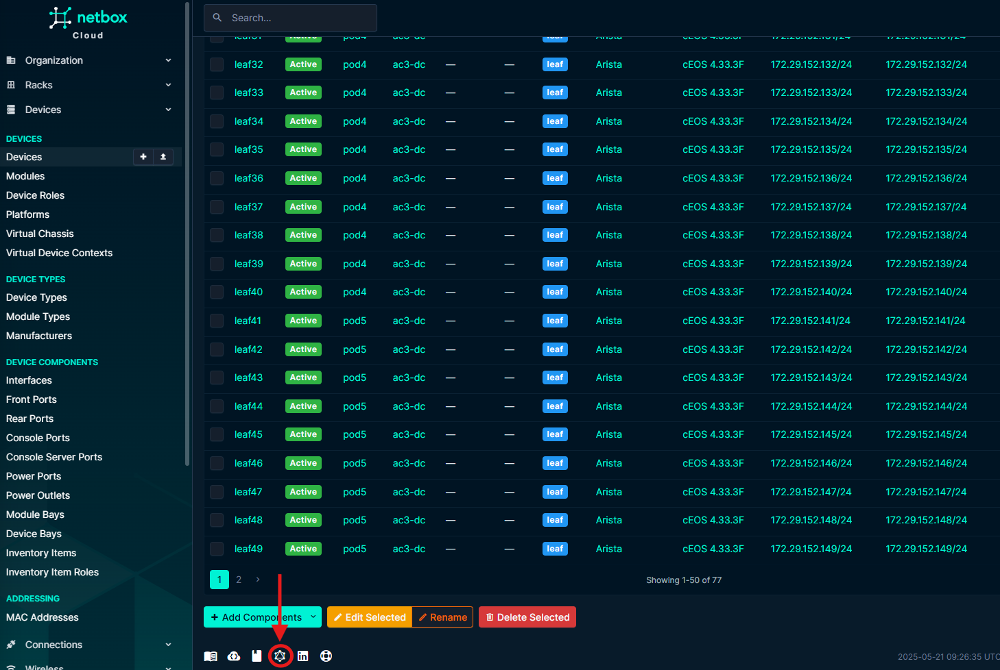
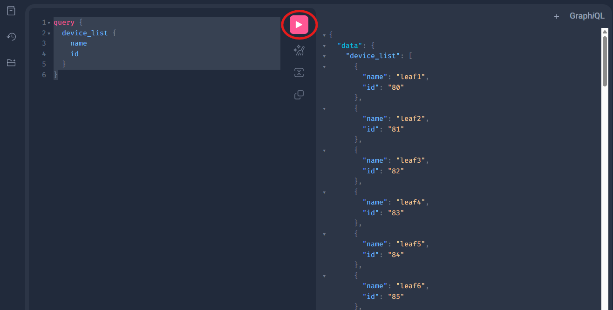

# Workbook 1: GraphQL

## Objectives

The objective of this workbook is to:
1. Understand how to use GraphQL.
2. Understand how to use NetBox GraphQL API.
3. Understand how to build a query that can be later used to retrieve device information from NetBox and for config generation.


## Exercise 1 – Log into NetBox GraphiQL 
1. Open your browser and navigate to the NetBox via the link provided in the lab details.
2. Click on the GraphiQL icon at the bottom of the page.



## Exercise 2 - Build and Execute a GraphQL Query
Lets first build our first GraphQL query to retrieve the name and ID of all devices with NetBox.

1. Copy the the query below into the GraphiQL editor and click the play button to execute.

```graphql
query {
  device_list {
    name
    id
  }
}
```

An example is shown below:



As you can see, the query returns a list of devices with their name and ID.

## Exercise 3 - Filter Your GraphQL Query
We will now filter our query to only return data about a single device

1. Copy the the query below into the GraphiQL editor and click the play button to execute.

```graphql
query {
  device_list(
    filters: { 
      name: { exact: "leaf1" }, 
    }) {
    name
    id
  }
}
```

You should see only one device returned. And an output similar to the one shown below:

```json
{
  "data": {
    "device_list": [
      {
        "name": "leaf1",
        "id": "80"
      }
    ]
  }
}
```

## Exercise 4 - Extend Your GraphQL Query

We will now extend our query to retrieve further information about the device from NetBox.

1. Extend the query to retrieve the following information about the device from NetBox:

    - `platform.name`
    - `role.name`
    - `device_type.model`
    - `device_type.slug`
    - `interfaces.name`
    - `interfaces.mgmt_only`
    - `interfaces.ip_addresses.address`
    - `primary_ip4.address`

For example for `platform.name`:

```graphql
query {
  device_list(
    filters: { 
      name: { exact: "leaf1" }, 
    }) {
    name
    id
    platform {
      name
    }
  }
}
```

> [!TIP]
> Feel free to use the GraphiQL documentation to build your query.


<details>
<summary>Solution</summary>

```graphql
query {
  device_list(
    filters: { 
      name: { exact: "leaf1" }, 
    }) {
    name
    id
    custom_fields
    role {
      name
    }
    device_type {
        model
        slug
    }
    platform {
        name
    }
    interfaces {
        name
        mgmt_only
        ip_addresses {
            address
        }
    }
    primary_ip4 {
      address
    }
  }
}
```

</details>


## Exercise 5 - Use Variables in Your GraphQL Query
Now that we can query GraphQL for a single device, and retrieve all of the information we need for generating a configuration. We will update our query to use a variables. 

This will make our lives easier when we go to use this query within Python, and we need to pass the query the hostname of the device we are querying. 

# create steps based on solution. provide detail in what they need to do.

1. Create a variable named `deviceName` with a value of `leaf1`.
2. Update your GraphQL query to use the variable.

<details>
<summary>Solution</summary>

**Variable**

```graphql
{
  "deviceName": "leaf1"
}
```

**GraphQL Query**

```graphql
query DeviceQuery($deviceName: String) {
  device_list(
    filters: { 
      name: { exact: $deviceName }, 
    }) {
    name
    custom_fields
    role {
      name
    }
    device_type {
        model
        slug
    }
    platform {
        name
    }
    interfaces {
        name
        mgmt_only
        ip_addresses {
            address
        }
    }
    primary_ip4 {
      address
    }
  }
}
```

</details>


