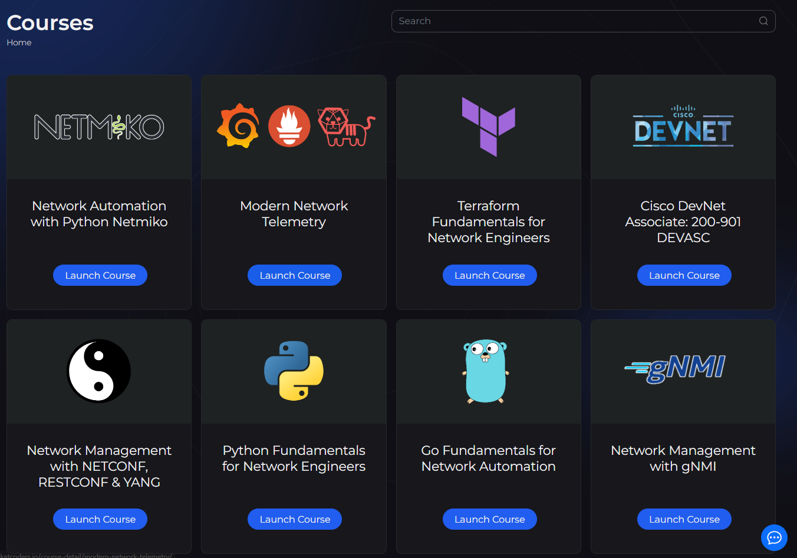

# Workbook 3: NAPALM

## Objectives

The objective of this workbook is to:
1. Understand how to use NAPALM.
2. Understand how to use NAPALM getters to retrieve data from a device.
3. Understand how to use NAPALM to configure a device.
4. Understand how to use NAPALM to deploy configuration to a device.
5. Understand how to use NAPALM with Nornir.

## Exercise 1 – Build a NAPALM Connection
Within this exercise, you will learn how to build a NAPALM connection to a device using the NAPALM context manager.

1. Run `task lab`, to start the ipython shell.
```bash
task lab
```

2. Create a NAPALM connection to your device. Please use the IP for your student id from the `LAB.md` file.
```python
from napalm import get_network_driver
from dotenv import load_dotenv
import os

load_dotenv()

DEVICE_PASSWORD = os.getenv("DEVICE_PASSWORD")

eos_driver = get_network_driver("eos")

MGMT_IP = "<YOUR MGMT IP>"

with eos_driver(MGMT_IP, "admin", DEVICE_PASSWORD) as napalm_connection:
    print(napalm_connection.is_alive())
```
 
You should see `True` as output, validating that the connection is alive.

```
{'is_alive': True}
```


## Exercise 2 – Work with NAPALM Getters
NAPALM providers various getters to retrieve data from a device in a structured. Lets now collect the statistics of the interfaces from your device.

1. Run `task lab`, to start the ipython shell.
```bash
task lab
```

2. Use the NAPALM getters to retrieve data from your device.
```python
from napalm import get_network_driver
from dotenv import load_dotenv
import os

load_dotenv()

DEVICE_PASSWORD = os.getenv("DEVICE_PASSWORD")

eos_driver = get_network_driver("eos")

with eos_driver(MGMT_IP, "admin", DEVICE_PASSWORD) as napalm_connection:
    print(napalm_connection.get_interfaces_counters())
```

## Exercise 3 – Device Configuration with NAPALM
On top of Getters NAPALM also provides a way to configure a device.
In other words config operation features both for merging and replacing the configuration upon a device.

We will now:
- create some configuration to create a loopback interface.
- push it to your device and then,
- retrieve the running configuration to ensure the configuration has been applied.

1. Run `task lab`, to start the ipython shell.
```bash
task lab
```

2. Use the NAPALM getters to retrieve data from your device.
```python
from napalm import get_network_driver
from dotenv import load_dotenv
import os

load_dotenv()

DEVICE_PASSWORD = os.getenv("DEVICE_PASSWORD")

eos_driver = get_network_driver("eos")

config = """
interface Loopback1
 description NAPALM Test
 ip address 88.88.88.88/32
"""

with eos_driver(MGMT_IP, "admin", DEVICE_PASSWORD) as napalm_connection:
    # Load the candidate config
    napalm_connection.load_merge_candidate(config=config)
    # Commit the candidate config
    napalm_connection.commit_config()
    # Print the running config
    print(napalm_connection.get_config()["running"])
```

After running the above code, you should see the new loopback interface in the running configuration. Like so:

```
...
interface Loopback1
   description NAPALM Test
   ip address 88.88.88.88/32
...
```

## Exercise 4 – NAPALM Nornir Integration
Lets now use NAPALM within Nornir via the NAPALM plugin. But lets have some fun. Lets collect the environment data for all devices from all the pods.

> [!TIP] If there are issues connecting. Due to the amount of students etc. Please use the commented filter to limit the devices to one of the pods.


1. Run `task lab`, to start the ipython shell.
```bash
task lab
```

2. Use the NAPALM getters to retrieve data from your device.
```python
from nornir_napalm.plugins.tasks import napalm_get

#nr = nr.filter(F(tenant__name="pod1"))

result = nr.run(task=napalm_get, getters=["environment"])
print_result(result)
```

You will now see the environment data for all devices. Great stuff!

## Exercise 5 – Putting it all together
We now have all the pieces. We`ve already generated configuration using the data from NetBox, via GraphQL and Nornir. We will now deploy our configuration to our leaf. At the point we deploy OSPF will be enabled and the loopback address will be distributed via OSPF. 

Let`s go!

> [!IMPORTANT]
> Please ensure you have added your STUDENT_ID the `.env` file before running the exercise.


1. Locate the `demo/004_nr_deploy.py` file.
2. Open the file, and review the code.
3. Update the Nornir filter to limit the devices to your student id.

```python
# remove
nr = nr.filter(F(tenant__name="pod1"))

# add
import os
from dotenv import load_dotenv

load_dotenv(override=True)

STUDENT_ID = os.getenv("STUDENT_ID")
nr = nr.filter(F(name=f"leaf{STUDENT_ID}"))
```

4. Run the script, `demo/004_nr_deploy.py`, but clicking on the play button in the top right corner.
5. Lets now confirm the state of OSPF and see our routing table with Netmiko.
6. Run
```bash
task lab
```

6. Use the NAPALM getters to retrieve data from your device.
```python
from nornir_netmiko.tasks import netmiko_send_command
from nornir_utils.plugins.functions import print_result

nr = nr.filter(F(name=f"leaf{STUDENT_ID}"))

result_ospf = nr.run(task=netmiko_send_command, command_string="show ip ospf neighbor")
result_route = nr.run(task=netmiko_send_command, command_string="show ip route")

print_result(result_ospf)
print_result(result_route)
```

If everything is successful, you will see the OSPF neighbors and routing table for your device. Like so:

```bash
vvvv netmiko_send_command ** changed : False vvvvvvvvvvvvvvvvvvvvvvvvvvvvvvvvvvv INFO
Neighbor ID     Instance VRF      Pri State                  Dead Time   Address         Interface
172.29.152.201  1        default  0   FULL                   00:00:37    10.1.0.41       Ethernet1

VRF: default
Source Codes:
       C - connected, S - static, K - kernel,
       O - OSPF, IA - OSPF inter area, E1 - OSPF external type 1,
       E2 - OSPF external type 2, N1 - OSPF NSSA external type 1,
       N2 - OSPF NSSA external type2, B - Other BGP Routes,
       B I - iBGP, B E - eBGP, R - RIP, I L1 - IS-IS level 1,
       I L2 - IS-IS level 2, O3 - OSPFv3, A B - BGP Aggregate,
       A O - OSPF Summary, NG - Nexthop Group Static Route,
       V - VXLAN Control Service, M - Martian,
...

 O        11.11.11.11/32 [110/20] <---- Leant Route
           via 10.1.0.41, Ethernet1
 C        172.29.152.0/24
           directly connected, Management0
```


## CONGRATULATIONS

Thank for attending!

You’ve now completed the workbooks. With the foundations you've built, you can easily scale this approach to thousands of devices. By simply adjusting your Nornir filters, your NetBox inventory, and the GraphQL queries, your automation can scale efficiently and reliably across large environments.

**What's next?**

Check out our full library of Network Automation Courses at Packet Coders — real-world training to help you master network automation ➜ [Click here](https://nebula.packetcoders.io/courses)




